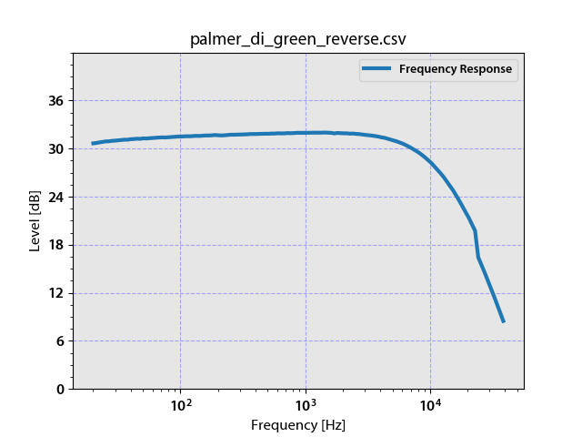

HP8903 audio analyser via Prologix GPIB
===================

The HP8903 is a remote controllable audio analyser. The device is old but thus available for sane prices.
The scripts mentioned here currently allow you to obtain a frequency/level measurement and create a plot
like the following.



The scripts are not yet cleaned up and this is the first version that is more of a proof-of-concept.
I will try to add other measurement types.


Features
========

Do the measurement witha Prologix GPIB interface, configured to provide the connection with a 
serial port.

Depending on the condition of your device, it may be sensible to do a loop-back measurement and
use this as a calibration reference while plotting. See option ```--calibration-file``` to
use this feature.


Installation
=========

You need Python 3, pyserial, pyyaml, matplotlib, argparse, math and csv libraries.

```pip3 install pyserial pyyaml matplotlib argparse math csv pyserial cherrypy fasteners```


Configuration
=============

```measure.py``` is statically configured through ```config.yml``` (Serial port, BAUD rate). Measurement configuration is done via command line arguments.

```graph.py``` has no internal configuration, customize it using command line arguments.

The parameter ```--help``` will give you details about the command line arguments.
